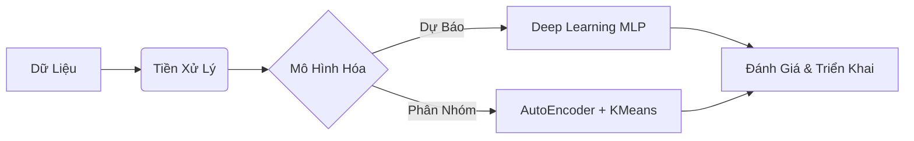

# Ứng dụng Deep Learning trong Phân tích và Dự báo Tỷ lệ Nghỉ việc của Nhân sự

  -orange?style=for-the-badge)

## 1. 📊 Tóm tắt Điều hành (Executive Summary)

Tài liệu này tổng hợp các kết quả nghiên cứu và triển khai kỹ thuật từ dự án ứng dụng **học sâu (Deep Learning)** vào quản trị nguồn nhân lực (HR Analytics). Trọng tâm của dự án là xây dựng một hệ thống dự báo khả năng nghỉ việc của nhân viên, giúp doanh nghiệp chủ động nhận diện rủi ro "chảy máu chất xám" và tối ưu hóa chi phí vận hành.

**Các kết quả then chốt:**
*   **Mô hình dự báo:** Sử dụng kiến trúc **Mạng nơ-ron đa lớp (MLP)** đạt độ chính xác (Accuracy) **75%** và quan trọng nhất là chỉ số **Recall đạt 66%** đối với lớp nhân viên có nguy cơ nghỉ việc.
*   **Phân cụm chiến lược:** Thông qua **AutoEncoder** và **KMeans**, dự án đã phân loại nhân sự thành **3 cụm (Cluster)** đặc trưng, cho phép doanh nghiệp áp dụng các chính sách giữ chân cá nhân hóa.
*   **Công cụ hỗ trợ:** Tích hợp hệ thống **Chatbot RAG** (Retrieval-Augmented Generation) để hỗ trợ nhà quản lý truy xuất thông tin nhân sự và quy định nội bộ tức thời.
*   **Giá trị kinh tế:** Phát hiện sớm rủi ro nghỉ việc giúp giảm thiểu chi phí tuyển dụng trung bình (ước tính khoảng **4.129 USD/nhân viên** theo SHRM) và bảo toàn tri thức nội bộ.

---

## 2. 🌐 Bối cảnh và Tính cấp thiết

Trong môi trường cạnh tranh, việc nhân viên nghỉ việc đột ngột gây ảnh hưởng tiêu cực đến văn hóa tổ chức và chi phí. Các phương pháp thống kê truyền thống thường hạn chế trong việc xử lý dữ liệu phi tuyến.

**Lý do lựa chọn Deep Learning:**
*   Học và trích xuất các đặc trưng phi tuyến từ tập dữ liệu lớn.
*   Xử lý hiệu quả các biến đa chiều (mức độ hài lòng, hiệu suất, lương...).
*   Cung cấp dự báo xác suất chính xác, hỗ trợ ra quyết định mang tính phòng ngừa.

---

## 3. 🔬 Phương pháp Nghiên cứu & Dữ liệu

### 3.1. Quy trình Thực hiện

### 3.2. Đặc điểm Dữ liệu
Dự án sử dụng **Dữ liệu Giả lập (Synthetic Data)** với 10.000 bản ghi, mô phỏng môi trường ngân hàng.

| Nhóm dữ liệu | Các thuộc tính tiêu biểu |
| :--- | :--- |
| **Nhân khẩu học** | Tuổi, Giới tính |
| **Công việc** | Chức vụ (JobRole), Cấp bậc (JobLevel), Phòng ban (Department) |
| **Hiệu suất & Lương** | % Hoàn thành KPI, Thu nhập hàng tháng, % Tăng lương |
| **Gắn kết** | Mức độ hài lòng, OverTime |
| **Mục tiêu** | **Attrition** (Nghỉ việc: 1; Ở lại: 0) - *Tỷ lệ nghỉ việc ~19.6%* |

### 3.3. Xử lý dữ liệu
1.  **Tiền xử lý:** Điền giá trị thiếu, loại bỏ định danh.
2.  **Mã hóa:** Chuyển đổi biến phân loại sang dạng số.
3.  **Xử lý mất cân bằng:** Áp dụng **Class Weights** để ưu tiên lớp thiểu số (Nghỉ việc).
4.  **Chuẩn hóa:** Sử dụng `StandardScaler`.

---

## 4. 🧠 Kiến trúc Deep Learning (MLP)

Mô hình được thiết kế với cấu trúc hình phễu để tối ưu hóa trích lọc thông tin:

*   **Input Layer:** Các đặc trưng đã chuẩn hóa.
*   **Hidden Block 1:** 128 nơ-ron, ReLU, Dropout 50%.
*   **Hidden Block 2:** 64 nơ-ron, LeakyReLU, Dropout 40%.
*   **Hidden Block 3:** 32 nơ-ron, LeakyReLU, Dropout 40%.
*   **Output Layer:** 1 nơ-ron (Sigmoid) -> Xác suất nghỉ việc.

**Chiến lược huấn luyện:**
*   Optimizer: **Adam** (LR=0.0001).
*   Callbacks: **EarlyStopping** (patience=20), **ReduceLROnPlateau**.
*   Regularization: Sử dụng **L2** để chống Overfitting.

---

## 5. 📉 Kết quả Thực nghiệm & Phân tích

### 5.1. Hiệu suất Mô hình
Dự án ưu tiên tối đa hóa **Recall** để không bỏ sót nhân sự có nguy cơ rủi ro.

*   **Ngưỡng phân loại (Threshold):** 0.5540
*   **Accuracy:** 75.0%
*   **Recall (Attrition=1):** 66% (Phát hiện 2/3 nhân viên thực tế sẽ nghỉ).
*   **ROC-AUC:** ~0.84

### 5.2. Phân Cụm Nhân Sự (Clustering)
Sử dụng **AutoEncoder** nén dữ liệu xuống 3 chiều, kết hợp **KMeans (k=3)**:

| Cụm | Đặc điểm | Tỷ lệ nghỉ | Yếu tố ảnh hưởng chính |
| :---: | :--- | :---: | :--- |
| **0** | **Nhân viên tuyến đầu** (Giao dịch viên...). Áp lực cao. | **Cao nhất** | Cơ hội thăng tiến, KPI, Sự hài lòng. |
| **1** | **Hành chính / Back-office.** Ổn định, thâm niên cao. | **Thấp nhất** | Thu nhập, Cấp bậc, Môi trường. |
| **2** | **Chuyên gia / Key Person.** Hiệu suất cao, giá trị lớn. | **Trung bình** | Lộ trình phát triển, Đãi ngộ đặc biệt. |

---

## 6. 🤖 Hệ thống Chatbot RAG

Đề xuất giải pháp **Retrieval-Augmented Generation (RAG)** cho ứng dụng thực tế:

1.  **Cơ sở tri thức:** Vector DB lưu trữ hồ sơ & quy định nhân sự.
2.  **Truy xuất (Retrieval):** Tìm kiếm ngữ cảnh liên quan khi có câu hỏi.
3.  **Sinh phản hồi (Generation):** LLM tổng hợp thông tin để trả lời quản lý (Ví dụ: *"Tại sao nhân viên A có nguy cơ nghỉ việc?"*).

---

## 7. 💡 Kết luận & Kiến nghị

**Kiến nghị cho doanh nghiệp:**
1.  **Hệ thống cảnh báo sớm:** Theo dõi xác suất nghỉ việc định kỳ.
2.  **Chính sách theo cụm:**
    *   *Cụm 0:* Giảm áp lực, luân chuyển nội bộ.
    *   *Cụm 2 (Key Person):* ESOP, lộ trình thăng tiến riêng biệt.
3.  **Số hóa dữ liệu định tính:** Tích hợp khảo sát, feedback để mô hình chính xác hơn.

> *"Việc bỏ sót một cá nhân có nguy cơ nghỉ việc (false negative) có thể dẫn đến gián đoạn công việc. Bằng cách ưu tiên tối đa hóa Recall, mô hình có thể bắt trọn toàn bộ các trường hợp rủi ro để can thiệp sớm."

